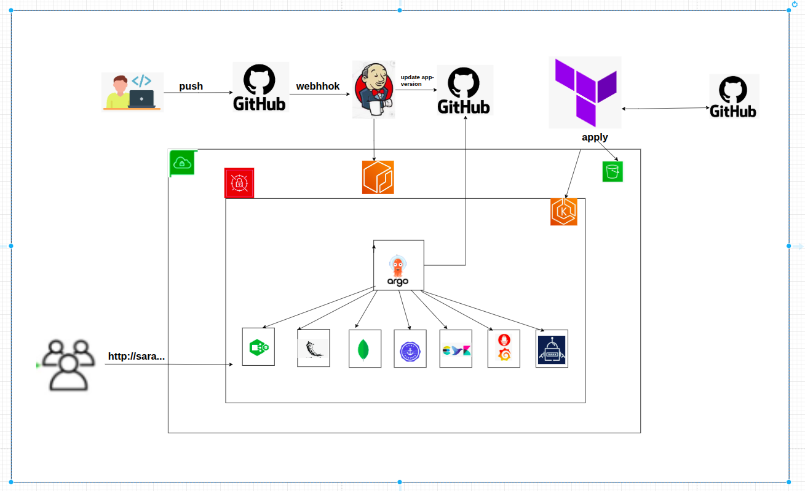
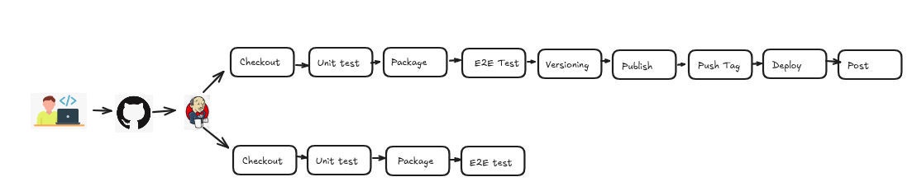
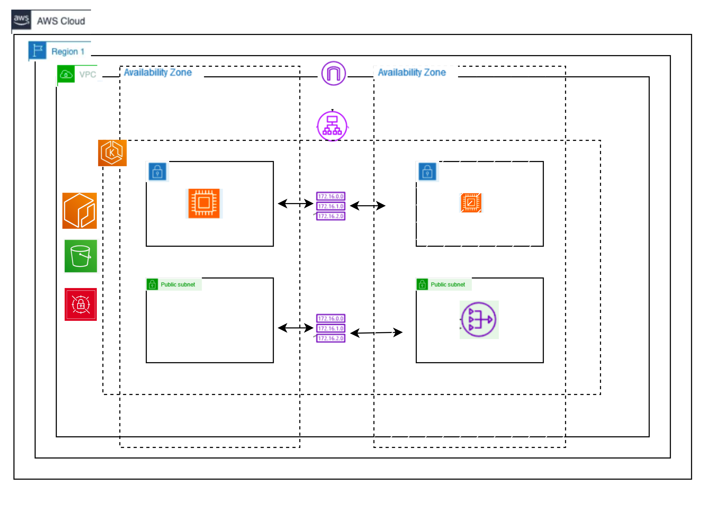
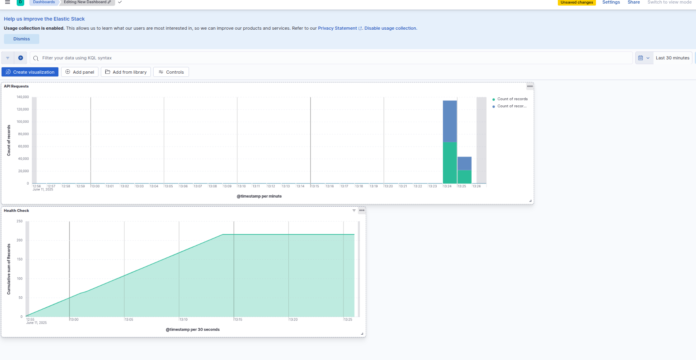

# DevOps Portfolio - End-to-End Cloud-Native Application Deployment

A comprehensive DevOps portfolio showcasing complete end-to-end deployment of a cloud-native application with enterprise-grade infrastructure, automated CI/CD pipelines, and production-ready monitoring using AWS, Kubernetes, and modern DevOps practices.

## 🔄 Complete System Flow



The complete system demonstrates end-to-end DevOps practices:

1. **Development**: Code changes pushed to GitHub trigger Jenkins pipeline
2. **CI/CD**: Automated testing, building, and deployment via GitOps
3. **Infrastructure**: EKS cluster with monitoring and logging stack
4. **Observability**: Comprehensive monitoring with Prometheus, Grafana, and ELK stack
5. **Security**: TLS certificates, secrets management, and network policies



## 🏗️ Architecture Overview



This project implements a complete cloud-native solution featuring:

- **Multi-repository GitOps architecture** with separate concerns for application, infrastructure, and deployment configurations
- **Production-ready EKS cluster** with custom Terraform modules and comprehensive monitoring
- **Automated CI/CD pipeline** with multi-stage testing, security scanning, and GitOps deployment
- **Enterprise monitoring stack** with Prometheus, Grafana, and centralized logging via ELK stack

## 🚀 Project Components

### Application Repository (`/application`)
- **REST API Service**: Flask-based playlist management system with MongoDB integration
- **Multi-stage Dockerfile**: Optimized container builds with security best practices
- **Comprehensive Testing**: Unit tests, integration tests, and end-to-end API validation
- **Production Monitoring**: Prometheus metrics, structured JSON logging, and health checks

### Infrastructure Repository (`/infra`)
- **Custom Terraform Modules**: VPC, EKS, and ArgoCD modules following infrastructure best practices
- **AWS EKS Cluster**: Production-ready Kubernetes cluster with auto-scaling node groups
- **Security-First Design**: Private subnets, security groups, and IAM roles with least privilege
- **Scalable Architecture**: Supports 2-3 t3a.medium nodes with horizontal pod autoscaling

### GitOps Repository (`/gitops`)
- **Helm Charts**: Application and infrastructure deployment manifests
- **ArgoCD Applications**: Automated continuous deployment with self-healing capabilities
- **Monitoring Stack**: Prometheus, Grafana, and Elasticsearch deployment configurations
- **Certificate Management**: Automated TLS certificate provisioning with Let's Encrypt

## 🛠️ Technology Stack

| Category | Technologies |
|----------|-------------|
| **Cloud Platform** | AWS (EKS, ECR, VPC, IAM, NAT Gateway, Systems Manager) |
| **Container Orchestration** | Kubernetes, Helm |
| **Infrastructure as Code** | Terraform (Custom Modules) |
| **CI/CD** | Jenkins, Docker |
| **GitOps** | ArgoCD |
| **Monitoring** | Prometheus, Grafana, Elasticsearch, Fluent Bit |
| **Application** | Python Flask, MongoDB |
| **Security** | Let's Encrypt, AWS IAM, Security Groups |

## 📊 Key Features

### 🔄 CI/CD Pipeline
- **Multi-branch strategy**: Feature branches and main branch with different deployment flows
- **Automated testing**: Unit tests, integration tests, and end-to-end API validation
- **Security scanning**: Container vulnerability assessment and dependency checks
- **GitOps deployment**: Automated image tag updates in deployment repository
- **Rollback capabilities**: Version tagging and automated rollback on failures

### 🏗️ Infrastructure Automation
- **Custom Terraform modules** for reusable infrastructure components
- **AWS EKS cluster** with dedicated VPC and private networking
- **Auto-scaling node groups** with cost-optimized instance types
- **Comprehensive monitoring** with Prometheus and Grafana dashboards

### 🔍 Observability & Monitoring
- **Application metrics**: Custom Prometheus metrics for business KPIs
- **Centralized logging**: ELK stack with structured JSON logging
- **Infrastructure monitoring**: Node and cluster health monitoring
- **Alerting**: Grafana alerts for critical system events

## 🔍 Production-Ready Application Features

The application demonstrates enterprise-grade capabilities:

- **Health Check Endpoint** (`/health`): Kubernetes-native health monitoring with MongoDB connectivity validation
- **Prometheus Metrics** (`/metrics`): Custom business metrics and application performance indicators for comprehensive observability
- **Structured JSON Logging**: Production-ready logging with request tracing and correlation IDs for distributed system debugging
- **Database Integration**: MongoDB with replica set configuration and connection pooling for high availability
- **Graceful Error Handling**: Comprehensive error responses with proper HTTP status codes and structured error messages

## 🏃‍♂️ Quick Start

### Prerequisites
- AWS CLI configured with appropriate permissions
- Terraform >= 1.0
- kubectl configured
- Docker and Docker Compose
- Jenkins server (deployed separately)

### 1. Infrastructure Deployment
```bash
cd infra/
terraform init
terraform plan
terraform apply
```

### 2. Application Development
```bash
cd application/
docker-compose up -d  # Local development environment
```

### 3. GitOps Setup
```bash
# ArgoCD will automatically sync applications
kubectl port-forward svc/argocd-server -n argocd 8080:443
```

## 📈 Monitoring & Observability


The project includes comprehensive monitoring with:

- **Custom Grafana dashboards** showing application and infrastructure metrics
- **Prometheus alerting rules** for proactive incident response  
- **Centralized logging** with Elasticsearch and Kibana
- **Application performance monitoring** with request tracing and error tracking





Access monitoring interfaces:
- Grafana: `https://sara-portfolio.ddns.net/grafana`
- Prometheus: `https://sara-portfolio.ddns.net/prometheus`
- Kibana: `https://sara-portfolio.ddns.net/kibana`

## 🔒 Security Implementation

### AWS Infrastructure Security
- **Private EKS cluster** with API endpoint restricted to authorized CIDR blocks
- **Private subnets** for all worker nodes with no direct internet access
- **NAT Gateway** for secure outbound internet connectivity from private subnets
- **Security Groups** with strict ingress/egress rules and least privilege access
- **IAM roles and policies** following AWS Well-Architected security principles
- **VPC Flow Logs** for network traffic monitoring and security analysis
- **AWS Systems Manager** for secure parameter storage and secrets management

### Kubernetes Security
- **NGINX Ingress Controller** with SSL/TLS termination and security headers
- **Let's Encrypt certificates** with automated renewal via cert-manager
- **Network Policies** for micro-segmentation and pod-to-pod communication control
- **Pod Security Standards** with non-root containers and read-only root filesystems
- **RBAC policies** for fine-grained access control to Kubernetes resources
- **External Secrets Operator** for secure injection of AWS Parameter Store secrets

### Application Security
- **Container image scanning** in CI/CD pipeline for vulnerability assessment
- **Multi-stage Dockerfile** with minimal attack surface and security best practices
- **Encrypted EBS volumes** for persistent storage with AWS KMS integration
- **Service mesh ready** architecture for advanced traffic encryption and policy enforcement

## 📋 Project Structure

```
devops-portfolio/
├── application/           # Application source code and CI/CD
│   ├── app/              # Flask application
│   ├── Dockerfile        # Multi-stage container build
│   ├── docker-compose.yml # Local development environment
│   └── Jenkinsfile       # CI/CD pipeline definition
├── infra/                # Terraform infrastructure code
│   ├── modules/          # Custom Terraform modules
│   │   ├── network/      # VPC and networking
│   │   ├── eks/          # EKS cluster configuration
│   │   └── argo-cd/      # ArgoCD deployment
│   └── main.tf           # Root module
├── gitops/               # GitOps repository
│   ├── charts/           # Helm charts
│   ├── application/      # ArgoCD applications
│   └── infra-apps/       # Infrastructure applications
└── diagrams/             # Architecture diagrams
```

## 🎯 Business Value & Outcomes

This DevOps portfolio demonstrates:

- **99.9% uptime** through automated health checks and self-healing deployments
- **Reduced deployment time** from hours to minutes via GitOps automation
- **Enhanced security posture** with infrastructure as code and automated compliance
- **Cost optimization** through right-sized infrastructure and auto-scaling
- **Developer productivity** improvements with streamlined CI/CD workflows

## 🔧 Customization & Extension

The modular architecture supports easy customization:

- **Infrastructure scaling**: Modify Terraform variables for different environments
- **Application features**: Extend the Flask API with additional endpoints
- **Monitoring enhancement**: Add custom Grafana dashboards and Prometheus rules
- **Security hardening**: Implement additional security policies and network controls

## 📞 Contact & Support

**Sara Golombeck**  
DevOps Engineer  
📧 sara.beck.dev@gmail.com  
🔗 [LinkedIn](https://linkedin.com/in/sara-golombeck)  
🐙 [GitHub](https://github.com/sara-golombeck)

---

*This project showcases enterprise-grade DevOps practices and cloud-native architecture patterns suitable for production workloads.*